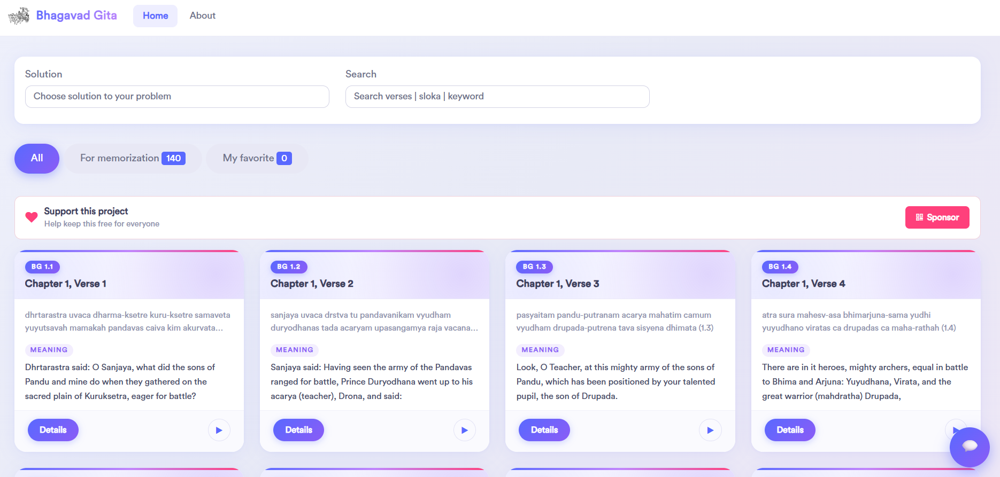

# Shrimad Bhagavad Gita

> A modern, interactive web app to explore the teachings of the Bhagavad Gita — find verses by life situation, save favorites, listen to meanings, and chat with an AI guide.

**Live site:** [shrimad-bhagavad-gita.github.io](https://shrimad-bhagavad-gita.github.io/)



---

## Features

| Feature | Description |
|---|---|
| **Solution filter** | Pick a life problem from the dropdown to see relevant verses |
| **Search** | Full-text search across verse names, codes, descriptions, and meanings |
| **Favorites** | Heart any card to save it; persists across sessions via localStorage |
| **My Favorite tab** | View all saved verses in one place with a live count badge |
| **Text-to-speech** | Play/stop the meaning of any verse with a single click |
| **Card detail view** | Deep-dive into a verse with Previous / Next navigation |
| **AI Chatbot** | Ask questions about the Gita and get contextual answers |
| **Google Sign-in** | Sign in with your Google account (Firebase Authentication) |
| **For Memorization tab** | Curated set of 140 verses recommended for memorization |
| **Responsive design** | Works on desktop, tablet, and mobile |

---

## How to Use

**1. Find verses for your situation**
Select a life problem from the *Solution* dropdown — the grid filters to only the relevant verses.

**2. Search freely**
Type any keyword, verse code, or phrase in the *Search* box to find matching cards instantly.

**3. Save favorites**
Click the heart icon on any card. Your favorites are saved locally and survive page refreshes.
Switch to the *My Favorite* tab to see only your saved verses.

**4. Listen to a meaning**
Click the play button on any card to hear the meaning read aloud. Click again to stop.

**5. Explore a verse in depth**
Click *Details* on any card to open the full card view. Use the *Previous* and *Next* buttons to browse through verses.

**6. Chat with the AI guide**
Use the chatbot (bottom-right) to ask any question about the Bhagavad Gita.

---

## Tech Stack

- **React 18** — functional components, hooks
- **Redux** — global state management
- **React Router v6** — client-side routing
- **Firebase Authentication** — Google Sign-in
- **Fuse.js** — fuzzy search
- **Bootstrap 5** — responsive grid
- **GitHub Pages** — hosting and deployment

---

## Local Development

```bash
# Install dependencies
npm install

# Start the dev server
npm run start:dev

# Run tests
npm test

# Build for production
npm run build

# Deploy to GitHub Pages
npm run deploy
```

The app runs at `http://localhost:3000` by default.

---

## Contributing

1. Fork the repository
2. Create a feature branch: `git checkout -b feature/your-feature`
3. Commit your changes: `git commit -m "feat: your feature"`
4. Push and open a Pull Request

---

## License

This project is open source. The teachings of the Bhagavad Gita are in the public domain.
